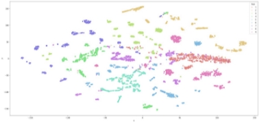

**Detection of Malicious Executable Files Using** 

1. **Motivation** 

   Identifying  malicious  software  has  become  increasingly  complex  as  cyber  threats  evolve. Modern  malware  often  employs  sophisticated techniques  like  polymorphic  layers  or  rapid self-updates to evade traditional detection methods based  on  signatures  or  heuristics.  Consequently,  it's  becoming  more  difficult  to  accurately  classify malware versus benign software. 

   To address this challenge, we plan to  leverage the Microsoft  malware  dataset  to  explore  the effectiveness  of  various  machine-learning techniques.  By  analysing  various executables, we aim  to  train  models  that  can  reliably  distinguish between  malicious  and  safe  files.  This  research endeavour holds promise for enhancing our ability to  combat  emerging  cyber  threats  and  safeguard digital environments. 

2. **References and Related Literature:** 

   **Malware  detection  using  Linear  SVM  by Baigaltugs et al.** 

   The  study  converts  each executable  into a vector using frequency counting and TFIDF methods. The classification of vectors  is done using a  linear SVM, and different kernels are tested. The data consists of 40 different classes. 

   **Malware  Detection  using  Machine  Learning by Dragos ̧ Gavrilut et al.** 

   The  study  extracts  features  from  binary  files  and converts  them  into  a  binary  vector  with  308 features.  The  training  is  done  to  minimise  the number of false positives, 

   with the number of benign files being much greater than  the  number  of  malware  files.  Various perceptron  algorithms  like  One-Sided  Perceptron, Kernelized One-Sided Perceptron 

   and  Cascade  Classification  are  utilised  for classification. 

3. **Methods and outcomes** 

Our  goal  is  to  assess  how  well  various  machine-learning algorithms can classify malware. We also wish  to  explore  feature  reduction  and  feature analysis  methods  such  as  PCA  and  LDA,  along with different methods for feature extraction to find out  which  features  are  best  for  malware classification. 

The three metrics that will be used are the number of features and testing accuracy. 

4. **Database Description** 

   The Microsoft Malware Classification dataset will be chosen,  containing  10,868  samples. Each sample will contain a .asm file, which will be the assembly dump obtained using the IDA tool. Each sample will also  have  a  name,  which  will  be  a 20-character-long  unique  hash  value,  and  an  integral  label  describing  which  class  the  malware belongs  to,  of  which  there  will  be  9  types.  The assembly dump will also contain a metadata dump. 

   Due to the skewed nature of the data, we have 

   also created an oversampled dataset which  uses the  synthetic  minority  oversampling  technique  to equalise the number of data points for each of the classes.  After  applying  the  technique,  the  final dataset we obtained is 26478 data points. 

   The  data  is  split  into  training  and  testing  sets following an 80-20 random split. The training set  is further  split using an 80-20 split to get a validation set. 

   

Fig 1. Original Dataset Class Distribution 

Original  and  oversampled  datasets  were considered,  and  three  features  were  dropped  to give better  performance  and  remove multicollinearity.   

**6.  Results and Analysis** 

We  will  use  the  log-loss  of  predicted probabilities and  the  accuracy  score  to  compare  different models.  The  performance  trends  observed  are Gaussian  Naive  Bayes  <  Support  Vector Machine<Random Forest regarding accuracy. 

Fig 2. TSNE Plot of the Original Dataset 

1. **Naive Bayes **

   In the case of naive Bayes, there was a negligible difference  in  the  results  of  both  datasets.  There was  no  noticeable  difference  in  training  and  CV  losses, indicating low variance. 

2. **Random Forest** 

   Random  forests  perform  the  best  among  the models  tested,  with  >  0.98  accuracy  scores,  and consistently benefit from oversampled datasets. 

Fig 3. Heatmap of covariance matrix showing linearly dependent variables  During this process, we also tried to ascertain the difference  in  time  taken  and  performance  of  the 

**5.  Methodology and Models**  RandomCV  and  GridSearchCV  modules  for The  same  method  is  followed  for  each  dataset  hyperparameter  tuning.GridSearchCV,  due  to obtained  to  train  three  models:  Naive  Bayes,  checking all possible hyperparameters provided  in Random  Forests,  and  Support  Vector  Machines.  a  given  range,  tends  to  take  much  more Individual steps  computation  time.  In  comparison, carried out for each are described below.  RandomSearchCV  gives  the  best hyperparameter sampled from distributions for each hyperparameter 

1. **Naive Bayes**  tested. This makes  it much faster to obtain a ”good Both  original  and  oversampled  datasets  are  enough”  set  of  hyperparameters,  especially  in considered.  scenarios where quick deployment is essential. 
1. **Random Forest**  With  the  nature  of  malware  constantly  evolving, Both original and oversampled datasets are utilised  quick  deployment  of  models  could  become when  training  the  models.  Grid  Search  CV  and  essential,  especially  in  critical  applications.  As Random  Search  CV  are  used  to  find  the  expected,  the  hyperparameters  provided  by  Ran- hyperparameters, number of estimators, max depth  domSearchCV  perform  worse  than  the  ones and the criterion (log-loss and GINI).  provided  by  GridSearchCV.  However,  with  the The  features  with  information  gain  less  than  a  difference  in the accuracy being  less than 0.5%  in certain  threshold  were  dropped.  The performance  the  case  of  RandomForest, the tradeoff regarding obtained  on the reduced feature set gave a  lower  quicker  training  time  can  be  helpful  in  certain generalisation error.  scenarios. 

   About  three  features  were  found  to  have  **6.3 SVM** 

   multicollinearity, and therefore, they were dropped.  The results of the SVM classifier were  just slightly 

` `lower  than the RF results,  indicating our dataset's 

**5.3 Support Vector Machine**  inherent  inseperability.  Like  RF,  there  is  a  slight 

` `increase  in  performance  when  using  the oversampled  dataset.  The  best-performing  kernel was the sigmoid kernel. 

7. **Conclusions** 

   We  have  shown  that  machine  learning  models based  on  simple  features  extracted  from executables can be used to classify different types of malware. We also tried to understand the effect of  features  on  the variance of a machine-learning model. Finally, we have tried to analyse the benefits and  tradeoffs  of  two  hyperparameter  testing frameworks.  To  build  on  this  work,  in  cases  of availability  of  live  executables,  more  quantitative 

   ` `information,  such  as  usage  of  the  network  stack, memory  usage,  number  of  calls  to  specific functions,  files  read,  etc.,  can  be  obtained during runtime,  which  can  greatly  help  in  the  quick analysis  and  deployment  of  models  to  be  more proactive  against  malware  detection  and classification. 

   **7.1 Contributions** 

   The  work  was  divided  among  the team members on the following basis: 

- Data Analysis: Kushagra 
- Random Search and Grid Search: Mudit 
- Support Vector Machine: Kushagra 
- Random Forest: Mudit 
- Compilation of Results: Kushagra 
- Presentation: Mudit 
8. **References** 
1. [Link to the Repository ](https://github.com/theniceguy8731/Malware_Classification_Project)
1. B.  Sanjaa  and  E.  Chuluun,  ”Malware detection using  linear SVM,” Ifost, 2013, pp. 136-138,  doi: 10.1109/IFOST.2013.6616872. 
1. D. Gavriluţ, M. Cimpoeşu, D. Anton and L. Ciortuz,  ”Malware  detection  using machine 

   ` `learning,”  2009  International Multiconference  on  Computer  Science and Information Technology, 2009, pp. 735-741, doi: 10.1109/IMC- SIT.2009.5352759 
